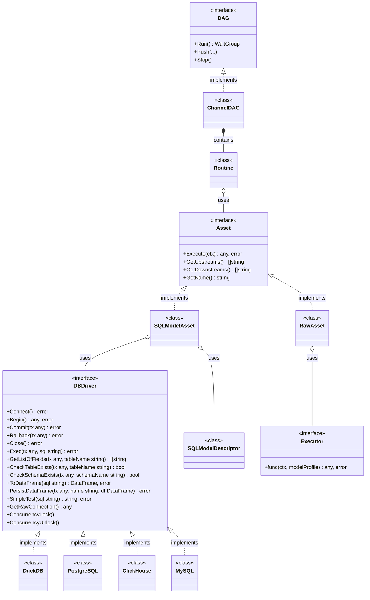
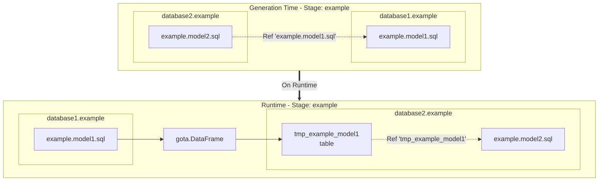

# Teal

- [Teal](#teal)
  - [QuickStart](#quickstart)
    - [Installation](#installation)
    - [CLI Commands Reference](#cli-commands-reference)
  - [Configuration](#configuration)
    - [config.yaml](#configyaml)
    - [profile.yaml](#profileyaml)
      - [Model Profile](#model-profile)
  - [Materializations](#materializations)
  - [Template functions](#template-functions)
    - [Template Engine Features](#template-engine-features)
    - [Template Functions](#template-functions-1)
    - [List of functions](#list-of-functions)
  - [Databases](#databases)
    - [DuckDB](#duckdb)
    - [PostgreSQL](#postgresql)
  - [Raw Assets](#raw-assets)
    - [Registration and declaration of a raw asset](#registration-and-declaration-of-a-raw-asset)
  - [Data testing](#data-testing)
    - [Simple model testing](#simple-model-testing)
      - [Test profile](#test-profile)
  - [General Architecture](#general-architecture)
    - [Cross database references](#cross-database-references)
  - [Road Map](#road-map)
    - [\[1.0.0+\]](#100)
  - [Contact](#contact)

In the changing field of data engineering, having strong, scalable, and user-friendly tools is essential. We introduce Teal, a new open-source ETL tool designed to improve your data transformation and orchestration.

Teal combines the best features of tools like [dbt](https://www.getdbt.com/), [Dagster](https://dagster.io/), and [Airflow](https://airflow.apache.org/), while solving common problems found in traditional Python-based solutions. Our goal is to provide data engineers and analysts with a powerful, easy-to-use platform that simplifies complex workflows and increases productivity.

Why Choose Teal?

- **Flexible Integration:** Integrate smoothly with various data sources and destinations, offering great flexibility and connectivity.
- **Optimized Performance with Go:** Teal uses Go's concurrency model with goroutines and channels to maximize performance and efficiency. This ensures your data pipelines run quickly and reliably, making the best use of your system's resources.
- **Go Stack Advantage:** Built on the efficient Go stack, Teal offers high performance, low latency, and excellent scalability. The simplicity and power of Go provide a solid foundation for managing complex ETL workflows.

## QuickStart

### Installation 

```bash
go install github.com/go-teal/teal/cmd/teal@latest
```

### CLI Commands Reference 

Teal CLI provides the following commands to manage your data pipeline projects:

#### `teal init` <!-- omit from toc -->

Creates a basic Teal project structure with default configuration files.

```bash
teal init
```

This command initializes a new Teal project with:
- `config.yaml` (database connections)
- `profile.yaml` (project configuration)
- `assets/` directory structure with example models and tests
- `store/` directory with sample CSV data

**No flags required.**

#### `teal gen` <!-- omit from toc -->

Generates Go code from SQL asset model files.

```bash
teal gen [flags]
```

**Flags:**
- `--project-path string` - Project directory (default: `.`)
- `--config-file string` - Path to config.yaml (default: `config.yaml`)
- `--model string` - Name of target model to generate (optional, generates all if not specified)

**Examples:**
```bash
teal gen                                    # Generate all models in current directory
teal gen --project-path ./my-project        # Generate in specific directory
teal gen --model staging.customers          # Generate specific model only
teal gen --config-file custom-config.yaml   # Use custom config file
```

#### `teal clean` <!-- omit from toc -->

Cleans generated files from the project.

```bash
teal clean [flags]
```

**Flags:**
- `--project-path string` - Project directory (default: `.`)
- `--model string` - Models for cleaning (default: `*` for all)
- `--clean-main` - Delete main.go files in cmd/ directory

**Examples:**
```bash
teal clean                                  # Clean all generated models (with confirmation)
teal clean --model staging.customers        # Clean specific model
teal clean --clean-main                     # Clean main.go files in addition to models
teal clean --project-path ./my-project      # Clean in specific directory
```

**Note:** When cleaning all models (`*`), you will be prompted for confirmation.

#### `teal ui` <!-- omit from toc -->

Starts the UI development server with hot-reload for debugging and monitoring.

```bash
teal ui [flags]
```

**Flags:**
- `--port int` - Port for API server (default: `8080`). UI Dashboard runs on port+1.
- `--log-level string` - Log level: `debug`, `info`, `warn`, `error` (default: `debug`)
- `--project-path string` - Project directory (default: `.`)

**Examples:**
```bash
teal ui                                     # Start on default port 8080 (Dashboard on 8081)
teal ui --port 9090                        # Start on port 9090 (Dashboard on 9091)
teal ui --log-level info                   # Start with info log level
teal ui --project-path ./my-project        # Start for specific project
```

The UI provides:
- **DAG Visualization:** Interactive graph showing all assets and dependencies
- **Execution Control:** Trigger DAG runs and monitor task status
- **Test Results:** View test execution results and data quality checks
- **Asset Inspection:** Examine asset data and execution results
- **Real-time Logs:** View logs for specific task executions

**Access:** Open `http://localhost:8081` (or custom port + 1) in your browser.

#### `teal version` <!-- omit from toc -->

Shows the current version of Teal CLI.

```bash
teal version
```

**No flags required.**

#### Getting Help <!-- omit from toc -->

```bash
teal --help              # Show all commands and their flags
teal [command] --help    # Show detailed help for specific command
```

### Creating your project <!-- omit from toc -->

```bash
mkdir my_test_project
cd my_test_project
```

### Init your project from scratch <!-- omit from toc -->

```bash
teal init
```

```bash
❯ ls -al
total 16
drwxr-xr-x@ 6 wwtlf  wwtlf  192 24 Jun 21:23 .
drwxr-xr-x  5 wwtlf  wwtlf  160 24 Jun 21:21 ..
drwxr-xr-x@ 3 wwtlf  wwtlf   96 24 Jun 07:46 assets
-rw-r--r--@ 1 wwtlf  wwtlf  302 24 Jun 07:51 config.yaml
drwxr-xr-x@ 2 wwtlf  wwtlf   64 24 Jun 20:03 docs
-rw-r--r--@ 1 wwtlf  wwtlf  137 24 Jun 07:46 profile.yaml
```

### Update **config.yaml** <!-- omit from toc -->

```yaml
version: '1.0.0'
module: github.com/my_user/my_test_project
connections:
  - name: default
    type: duckdb
    config:
      path: ./store/test.duckdb            
      extensions:
        - postgres
        - httpfs         
      # extraParams: 
      #   - name: "name"
      #     value: "value"
```

1. `module` param will be used as a module in go.mod
2. Make sure the dir from the `path` exists.

### Update **profile.yaml** <!-- omit from toc -->

```yaml
version: '1.0.0'
name: 'my-test-project'
connection: 'default'
models: 
  stages:
    - name: staging
    - name: dds  
    - name: mart
```

1. `name` will be used as a name for the binary file

### Generate go project <!-- omit from toc -->

```bash
teal gen
```

You'll see the following output

```bash
project-path: .
config-file: ./config.yaml
Building: staging.stg_airports.sql
Building: staging.stg_crew_assignments.sql
Building: staging.stg_employees.sql
Building: staging.stg_flights.sql
Building: staging.stg_routes.sql
Building: dds.dim_airports.sql
Building: dds.dim_employees.sql
Building: dds.dim_routes.sql
Building: dds.fact_crew_assignments.sql
Building: dds.fact_flights.sql
Building: mart.mart_airport_statistics.sql
Building: mart.mart_crew_utilization.sql
Building: mart.mart_flight_performance.sql
Files 26
./cmd/hello-world/hello-world.go ...................................... [OK]
./cmd/hello-world-ui/hello-world-ui.go ................................ [OK]
./go.mod .............................................................. [OK]
./Makefile ............................................................ [OK]
./internal/assets/staging.stg_airports.go ............................. [OK]
./internal/assets/staging.stg_crew_assignments.go ..................... [OK]
./internal/assets/staging.stg_employees.go ............................ [OK]
./internal/assets/staging.stg_flights.go .............................. [OK]
./internal/assets/staging.stg_routes.go ............................... [OK]
./internal/assets/dds.dim_airports.go ................................. [OK]
./internal/assets/dds.dim_employees.go ................................ [OK]
./internal/assets/dds.dim_routes.go ................................... [OK]
./internal/assets/dds.fact_crew_assignments.go ........................ [OK]
./internal/assets/dds.fact_flights.go ................................. [OK]
./internal/assets/mart.mart_airport_statistics.go ..................... [OK]
./internal/assets/mart.mart_crew_utilization.go ....................... [OK]
./internal/assets/mart.mart_flight_performance.go ..................... [OK]
./internal/model_tests/root.test_data_integrity.go .................... [OK]
./internal/model_tests/root.test_flight_delays.go ..................... [OK]
./internal/model_tests/dds.test_dim_airports_unique.go ................ [OK]
./internal/model_tests/dds.test_dim_employees_unique.go ............... [OK]
./internal/model_tests/dds.test_dim_routes_unique.go .................. [OK]
./internal/assets/configs.go .......................................... [OK]
./docs/graph.mmd ...................................................... [OK]
./docs/README.md ...................................................... [OK]
./internal/model_tests/configs.go ..................................... [OK]
```

**Important:**
Teal automatically generates **`docs/README.md`** with comprehensive project documentation:

- Project configuration and database connections
- Complete model tree with dependencies and asset counts
- RAW assets documentation (if any)
- Build and run instructions

**This documentation is designed to be used with AI code assistants** like Claude Code, GitHub Copilot, Cursor, and Gemini Code Assist. See the "Using with AI Assistants" section below.

Your DAG is depicted in the Mermaid diagram file `docs/graph.mmd`

**Note:** Teal generates two main.go files:

- `cmd/my-test-project/my-test-project.go` - Production binary with Channel DAG for efficient execution
- `cmd/my-test-project-ui/my-test-project-ui.go` - Debug UI binary with Debug DAG and REST API server for development

1. Run `go mod tidy`

### Start development with hot-reload <!-- omit from toc -->

```bash
# Start UI server with automatic file watching and hot-reload
teal ui

# Access the UI Dashboard at http://localhost:8081
# API server runs on http://localhost:8080
```

The `teal ui` command watches for changes in:

- `assets/` (all SQL models and tests)
- `profile.yaml`
- `config.yaml`

When changes are detected, it automatically:

1. Regenerates Go code
2. Restarts the API server (port 8080)
3. UI Dashboard (port 8081) continues running without interruption
4. Maintains the same ports

**UI Dashboard** provides a visual interface with:

- Interactive DAG visualization
- Real-time execution monitoring
- Test results and data quality checks
- Asset data inspection
- Execution logs

Final project structure:

```bash
.
├── Makefile
├── assets
│   ├── models
│   │   ├── dds
│   │   │   ├── dim_airports.sql
│   │   │   ├── dim_employees.sql
│   │   │   ├── dim_routes.sql
│   │   │   ├── fact_crew_assignments.sql
│   │   │   └── fact_flights.sql
│   │   ├── mart
│   │   │   ├── mart_airport_statistics.sql
│   │   │   ├── mart_crew_utilization.sql
│   │   │   └── mart_flight_performance.sql
│   │   └── staging
│   │       ├── stg_airports.sql
│   │       ├── stg_crew_assignments.sql
│   │       ├── stg_employees.sql
│   │       ├── stg_flights.sql
│   │       └── stg_routes.sql
│   └── tests
│       ├── dds
│       │   ├── test_dim_airports_unique.sql
│       │   ├── test_dim_employees_unique.sql
│       │   └── test_dim_routes_unique.sql
│       ├── test_data_integrity.sql
│       └── test_flight_delays.sql
├── cmd
│   ├── hello-world
│   │   └── hello-world.go
│   └── hello-world-ui
│       └── hello-world-ui.go
├── config.yaml
├── docs
│   ├── README.md
│   └── graph.mmd
├── go.mod
├── go.sum
├── internal
│   ├── assets
│   │   ├── configs.go
│   │   ├── dds.dim_airports.go
│   │   ├── dds.dim_employees.go
│   │   ├── dds.dim_routes.go
│   │   ├── dds.fact_crew_assignments.go
│   │   ├── dds.fact_flights.go
│   │   ├── mart.mart_airport_statistics.go
│   │   ├── mart.mart_crew_utilization.go
│   │   ├── mart.mart_flight_performance.go
│   │   ├── staging.stg_airports.go
│   │   ├── staging.stg_crew_assignments.go
│   │   ├── staging.stg_employees.go
│   │   ├── staging.stg_flights.go
│   │   └── staging.stg_routes.go
│   └── model_tests
│       ├── configs.go
│       ├── dds.test_dim_airports_unique.go
│       ├── dds.test_dim_employees_unique.go
│       ├── dds.test_dim_routes_unique.go
│       ├── root.test_data_integrity.go
│       └── root.test_flight_delays.go
├── pkg
│   └── services
├── profile.yaml
└── store
    ├── airports.csv
    ├── crew_assignments.csv
    ├── employees.csv
    ├── flights.csv
    └── routes.csv
```

### Using Generated Documentation with AI Assistants <!-- omit from toc -->

The `docs/README.md` file generated by Teal contains comprehensive project information that can be directly included in AI code assistant contexts:

**Claude.ai / Claude Code:**

```txt
@docs/README.md - Include this file to provide complete project context
```

**Cursor IDE:**

- Add `docs/README.md` to `.cursorrules` or reference it: `@docs/README.md`

**GitHub Copilot (VS Code):**

- Open `docs/README.md` in a tab or reference: `// See docs/README.md`

**Gemini Code Assist:**

- Add `docs/README.md` to workspace context

**Example Prompts:**

```txt
"Based on @docs/README.md, add a new mart layer asset aggregating transactions by address"
"Using @docs/README.md, which database connection should staging models use?"
"According to @docs/README.md, create an incremental model in the dds stage"
```

The generated README provides AI assistants with complete understanding of your pipeline structure, connections, dependencies, and patterns.

### Run your project <!-- omit from toc -->

**Using Make (recommended for development):**

The generated project includes a Makefile with convenient targets:

```bash
# Generate assets and run UI debug server (default port 8080)
make run

# Run on custom port
make run PORT=9090

# Build production binary
make build

# Build UI debug binary
make build-ui

# Run with tests
make run-with-tests

# View all available commands
make help
```

**Production mode (Channel DAG):**

First, build the production binary:
```bash
# Build the production binary
go build -o bin/my-test-project ./cmd/my-test-project/my-test-project.go

# Make it executable (Unix/Linux/Mac)
chmod +x bin/my-test-project
```

Then run the compiled binary with various options:

```bash
# Basic run with auto-generated task name and tests
./bin/my-test-project

# Run with custom task name
./bin/my-test-project --task-name "etl_batch_001"

# Run with input data and human-readable logs
./bin/my-test-project \
  --input-data '{"source":"api","date":"2024-01-01"}' \
  --log-output raw \
  --log-level info

# Run without tests for faster execution
./bin/my-test-project --with-tests=false

# Production deployment with minimal logging
./bin/my-test-project \
  --task-name "prod_$(date +%Y%m%d_%H%M%S)" \
  --log-level error \
  --log-output json

# Schedule with cron (example)
# 0 */6 * * * /path/to/bin/my-test-project --task-name "scheduled_$(date +\%Y\%m\%d_\%H\%M\%S)" --log-level info
```

**Debug UI mode (recommended):**

```bash
# Run UI debug server with hot-reload (watches for file changes)
# API server on port 8080, UI Dashboard on port 8081
teal ui

# Run on custom port with specific log level
# API server on port 9090, UI Dashboard on port 9091
teal ui --port 9090 --log-level info
```

The `teal ui` command automatically:

- Starts API server (default port 8080) with REST endpoints
- Launches UI Dashboard web application (port 8081) for visual monitoring
- Watches `assets/`, `profile.yaml`, and `config.yaml` for changes
- Regenerates code when files change
- Restarts API server automatically (UI Dashboard continues running)
- Handles graceful shutdown

**Access the UI Dashboard:** Open `http://localhost:8081` in your browser for visual DAG monitoring, execution control, and test results.

**Alternative: Run UI server directly (without hot-reload):**

```bash
# Run UI debug server directly
go run ./cmd/my-test-project-ui/my-test-project-ui.go

# Run on custom port
go run ./cmd/my-test-project-ui/my-test-project-ui.go --port 9090
```

**Note:** For production deployments, always use the compiled binary rather than `go run` for better performance and reliability.


### Understanding the Generated Main Files <!-- omit from toc -->

Teal generates two entry points for different use cases:

#### Production Binary (my-test-project.go) <!-- omit from toc -->

- Uses **Channel DAG** for high-performance concurrent execution
- Generates unique task names with timestamps (e.g., `my-test-project_1703123456`)
- Optimized for production deployments with minimal dependencies
- No UI server or debugging overhead

**Command-line arguments:**

- `--task-name` - Custom task name (optional, auto-generated if not provided)
- `--input-data` - Input data in JSON format (optional)
- `--log-output` - Log output format: `json` or `raw` (default: `json`)
- `--log-level` - Log level: `panic`, `fatal`, `error`, `warn`, `info`, `debug`, `trace` (default: `debug`)
- `--with-tests` - Run with tests enabled (default: `true`)

#### Debug UI Binary (my-test-project-ui.go) <!-- omit from toc -->

- Uses **Debug DAG** for visualization and monitoring
- Provides REST API endpoints for DAG control and status
- Includes execution tracking and task history
- Ideal for development and debugging

**Recommended: Use `teal ui` command with hot-reload:**

```bash
teal ui --port 8080 --log-level debug
```

The `teal ui` command provides:

- Automatic file watching (assets, config, profile)
- Hot-reload on changes (regenerates code and restarts server)
- Graceful shutdown handling
- Built-in debouncing to prevent excessive regenerations

**Direct execution command-line arguments:**

- `--port` - Port for debug UI server (default: `8080`)
- `--log-output` - Log output format: `json` or `raw` (default: `raw`)
- `--log-level` - Log level: `panic`, `fatal`, `error`, `warn`, `info`, `debug`, `trace` (default: `info`)

**UI Dashboard:**

When you run `teal ui`, it automatically launches a companion **UI Dashboard** web application on port `8081` (API port + 1) alongside your project's API server. This provides a visual interface for monitoring and controlling your data pipelines:

**Features:**

- **DAG Visualization**: Interactive graph showing all assets and their dependencies
- **Execution Control**: Trigger DAG runs, monitor task status, and view execution history
- **Test Results**: View test execution results and data quality checks
- **Asset Inspection**: Examine asset data and execution results
- **Real-time Logs**: View logs for specific task executions
- **API Documentation**: Full REST API access for programmatic control

**Access:**

```bash
# Start with teal ui (API on port 8080, Dashboard on port 8081)
teal ui

# Or with custom port (API on 9090, Dashboard on 9091)
teal ui --port 9090
```

The UI Dashboard is served by the `teal` CLI binary itself (not your generated project) on `http://localhost:8081` (or custom port + 1). All frontend assets are embedded in the teal binary for zero-dependency deployment.

**Architecture:**

- **UI Assets Server** (port 8081): Static file server embedded in `teal` CLI binary serving React-based dashboard
  - Located in: `teal` binary (`internal/domain/services/ui_assets_server.go`)
  - Persists across API server restarts
- **Debug API Server** (port 8080): Your generated project's REST API for DAG operations, tests, and data access
  - Located in: `./cmd/<project-name>-ui/<project-name>-ui.go` in your generated project
  - Restarts automatically when code changes are detected
  - Provides REST endpoints for the UI Dashboard to consume
- **Hot-Reload**: When files change, only the Debug API server restarts; UI Assets server continues running without interruption

Example production code structure:

```go
package main

import (
    _ "github.com/marcboeker/go-duckdb"  // Uncomment for DuckDB
    "encoding/json"
    "flag"
    "fmt"
    "time"
    "github.com/rs/zerolog"
    "github.com/rs/zerolog/log"
    modeltests "github.com/my_user/my_test_project/internal/model_tests"
    "github.com/go-teal/teal/pkg/core"
    "github.com/go-teal/teal/pkg/dags"
    "github.com/my_user/my_test_project/internal/assets"
)

func main() {
    // Parse command-line flags
    inputData := flag.String("input-data", "", "Input data in JSON format")
    logOutput := flag.String("log-output", "json", "Log output format")
    logLevel := flag.String("log-level", "debug", "Log level")
    withTests := flag.Bool("with-tests", true, "Run with tests")
    customTaskName := flag.String("task-name", "", "Custom task name")
    flag.Parse()

    // Configure logging
    if *logOutput == "raw" {
        log.Logger = log.Output(zerolog.ConsoleWriter{Out: os.Stderr})
    }
    
    // Initialize core and config
    core.GetInstance().Init("config.yaml", ".")
    config := core.GetInstance().Config
    
    // Generate unique task name or use custom
    var taskName string
    if *customTaskName != "" {
        taskName = *customTaskName
    } else {
        taskName = fmt.Sprintf("my-test-project_%d", time.Now().Unix())
    }
    
    // Initialize and run DAG
    var dag dags.DAG
    if *withTests {
        dag = dags.InitChannelDagWithTests(assets.DAG, assets.ProjectAssets, 
                                          modeltests.ProjectTests, config, taskName)
    } else {
        dag = dags.InitChannelDag(assets.DAG, assets.ProjectAssets, config, taskName)
    }
    
    wg := dag.Run()
    result := <-dag.Push(taskName, inputDataMap, make(chan map[string]interface{}))
    log.Info().Str("taskName", taskName).Any("Result", result).Send()
    dag.Stop()
    wg.Wait()
}
```

What this code does:

1. `dag.Run()` builds a DAG based on Ref from your .sql models, where each node is an asset and each edge is a GO channel.
2. `dag.Push()` triggers the execution of this DAG with a unique task name for tracking.
3. `dag.Stop()` sends the deactivation command.

## Configuration

### config.yaml

```yaml
version: '1.0.0'
module: github.com/my_user/my_test_project
connections:
  - name: default
    type: duckdb
    config:
      path: ./store/test.duckdb            
      extensions:
        - postgres
        - httpfs         
      # extraParams: 
      #   - name: "name"
      #     value: "value"
```

1. Teal supports multiple connections.

2. The following databases are supported at the moment (v0.2.1):
    - [DuckDB](#duckdb), see the specific config params.
    - [PostgreSQL](#postgresql), see the specific config params.

|Param             |Type             |Description                                                   |
|------------------|-----------------|--------------------------------------------------------------|
|version           |String constant  |1.0.0                                                         |
|module            |String           |Generated Go module name                                      |
|connections       |Array of objects |Array of database connections                                 |
|connections.name  |String           |Name of the connection used in the model profile              |
|connections.type  |String           |Driver name of the database connection `duckdb`, `postgres`|

### profile.yaml

```yaml
version: '1.0.0'
name: 'my-test-project'
connection: 'default'
models: 
  stages:
    - name: staging
      models:
        - name: model1
        # see model profiles
          tests:
            - name: "root.test_model1_unique"
            # see test profiles
    - name: dds  
    - name: mart
      models:
        - name: custom_asset
          materialization: 'raw'
          connection: 'default'
          raw_upstreams:
            - "dds.model1"
            - "dds.model2"
```

|Param|Type|Description|
|-----|----|-----------|
|version|String constant|`1.0.0`|
|name|String|Base name for generated binaries. Creates both `cmd/<name>/` for production and `cmd/<name>-ui/` for debug UI.|
|connection|String|Connection from `config.yaml` by default.|
|models.stages|Array of stages|List of stages for models. For each stage, a folder `assets/models/<stage name>` must be created in advance.|
|models.stages|See: [Model Profile](#model-profile)||
|models.stages.`name: <stage name>`.models.`<name: model name>`.tests|See: [Test Profile](#test-profile)|Test cases defined in the model profiles are executed immediately after the execution of the model itself.|
|models.stages.`name: <stage name>`.models.`<name: model name>`.raw_upstreams|See: [Raw assets](#raw-assets)|A list of upstreams that supply data to this raw asset or that must be executed before this asset is run.|

#### Model Profile

The asset profile can be specified via the `profile.yaml` file or via a GO template in your sql model file in the sub-template `{{ define "profile.yaml" }} ... {{ end }}`:

```yaml
{{ define "profile.yaml" }}
    connection: 'default'
    description: 'Staging addresses from CSV file'  # Optional: Describes the model's purpose
    materialization: 'table'
    is_data_framed: true
    primary_key_fields:
      - "id"
    indexes:
      - name: "wallet"
        unique: false
        fields:
          - "wallet_id"
{{ end }}

select
    id,
    wallet_id,
    wallet_address,
    currency
    from read_csv('store/addresses.csv',
    delim = ',',
    header = true,
    columns = {
        'id': 'INT',
        'wallet_id': 'VARCHAR',
        'wallet_address': 'VARCHAR',
        'currency': 'VARCHAR'}
    )
```

|Param|Type|Default value|Description|
|-----|----|-------------|-----------|
|name|String|filename|The model name must match the file name, disregarding the system extension (.sql).|
|description|String||Optional description of the model's purpose, displayed in UI and API responses.|
|connection|String|profile.connection|The connection name from `config.yaml`.|
|materialization|String|table|See [Materializations](#materializations).|
|is_data_framed|boolean|false|See [Cross-database references](#cross-database-references).|
|persist_inputs|boolean|false|See [Cross-database references](#cross-database-references).|
|primary_key_fields|Array of string||List of fields for the primary unique index|
|indexes|Array of Indexes||List of indexes for the asset (only for the table and incremental materializations)|
|indexes.`<name: IndexName>`|String||Name of the index|
|indexes.`<name: IndexName>`.Unique|boolean|false|flag of the uniqueness of the Index|
|indexes.`<name: IndexName>`.fields|Array of string||List of fields for the index|

## Materializations

|Materializations|Description|
|---|---|
|table|The result of an SQL query execution is stored in the table corresponding to the model name. If the table does not exist, it will be created. If the table already exists, it will be cleared using the truncate method.|
|incremental|The result of the query execution is added to the existing table. If the table does not exist, it will be created.|
|view|The SQL query is saved as a view.|
|custom|A custom SQL query is executed; no tables or views are created.|
|raw|A custom Go function is executed.|

## Template functions

Teal uses the **[pongo2](https://github.com/flosch/pongo2) template engine** (v6), which is **Django-compatible**. This means you can use familiar Django/Jinja2 template syntax in your SQL models.

### Template Engine Features

- **Django-compatible syntax**: If you know Django templates or Jinja2, you already know pongo2
- **Control structures**: `...`, `...`
- **Variables and filters**: `{{ variable }}`, `{{ variable|upper }}`, `{{ variable|safe }}`
- **Template inheritance**: `` and `` (for advanced use cases)
- **Comments**: `{# This is a comment #}`

### Template Functions

Teal uses **pongo2** (Django/Jinja2-style) template syntax with double braces `{{ }}` and control structures ``. Template functions are evaluated at different stages:

**Generation-time evaluation** (during `teal gen`):

- `{{ Ref("staging.model") }}` - Replaced with actual table name and establishes DAG dependencies
- `{{ this() }}` - Replaced with current model's table name

**Runtime evaluation** (during DAG execution):

- `{{ TaskID }}` - Current task identifier
- `{{ TaskUUID }}` - Unique task UUID
- `{{ InstanceName }}` - DAG instance name
- `{{ InstanceUUID }}` - DAG instance UUID
- `{{ ENV("VAR_NAME", "default") }}` - Environment variable value
- `...` - Control structures

**Example showing both:**
```sql
-- Generation time: Ref() resolves to "staging.raw_orders"
-- Runtime: TaskID gets actual value during execution
SELECT *
FROM {{ Ref("staging.raw_orders") }}
WHERE task_id = '{{ TaskID }}'
```

**Processing Flow:**

1. **During `teal gen`**: `{{ Ref(...) }}` and `{{ this() }}` are evaluated and replaced with actual table names. All other template syntax is preserved in the generated Go code.
2. **At runtime**: `{{ TaskID }}`, `{{ ENV(...) }}`, and control structures `` are evaluated when SQL executes during DAG execution.

### List of functions

Available template functions and variables:

|Name|Input Parameters|Output|When Evaluated|Description|Example Usage|
|--|--|--|--|--|--|
|Ref|`"<stage>.<model>"`|string|Generation-time|Main function for DAG dependencies. Replaced with actual table name during `teal gen`.|`{{ Ref("staging.customers") }}`|
|this|None|string|Generation-time|Returns the name of the current table.|`{{ this() }}`|
|ENV|`envName`, `defaultValue`|string|Runtime|Gets environment variable value at runtime.|`{{ ENV("DB_SCHEMA", "public") }}`|
|IsIncremental|None|boolean|Runtime|Returns true if model is in incremental mode. Use in control structures.|`...`|
|TaskID|(variable)|string|Runtime|The task identifier from the Push method.|`{{ TaskID }}`|
|TaskUUID|(variable)|string|Runtime|The unique UUID assigned for task tracking.|`{{ TaskUUID }}`|
|InstanceName|(variable)|string|Runtime|The DAG instance name.|`{{ InstanceName }}`|
|InstanceUUID|(variable)|string|Runtime|The unique UUID assigned to the DAG instance.|`{{ InstanceUUID }}`|

**Complete Example:**

```sql
{{ define "profile.yaml" }}
    materialization: 'incremental'
    is_data_framed: true
{{ end }}

SELECT
    order_id,
    customer_id,
    order_date,
    total_amount,
    '{{ TaskID }}' as etl_task_id,
    '{{ TaskUUID }}' as etl_run_id,
    current_timestamp as processed_at
FROM {{ Ref("staging.raw_orders") }}  -- Resolved at generation-time

    WHERE order_date > (SELECT COALESCE(MAX(order_date), '1900-01-01') FROM {{ this() }})

```

## Databases

### DuckDB

1. Specific config params:

|Param|Type|Description|
|-----|----|-----------|
|connections.type  |String|duckdb|
|extensions|Array of strings|List of [DuckDB extensions](https://duckdb.org/docs/extensions/overview.html). Extensions will be installed during the creation of the database and loaded before the asset execution.|
|path|String|Path to the DuckDB database file.|
|path_env|String|Environment variable that contains the path to the data file. If set, the `path` setting is ignored|
|extraParams|Object|Pairs of name-value parameters for [DuckDB configuration](https://duckdb.org/docs/configuration/overview.html).|

### PostgreSQL

1. Specific config params:

| Param            | Type   | Description                                                                                                  |
|------------------|--------|--------------------------------------------------------------------------------------------------------------|
|connections.type  |String|postgres|
| host             | String | The hostname or IP address of the PostgreSQL server.                                                        |
| host_env         | String | The environment variable name for the PostgreSQL server hostname or IP address.                             |
| port             | String | The port number on which the PostgreSQL server is running. Default is typically `5432`.                     |
| port_env         | String | The environment variable name for the PostgreSQL server port number.                                        |
| database         | String | The name of the database to connect to on the PostgreSQL server.                                             |
| database_env     | String | The environment variable name for the PostgreSQL database name.                                              |
| user             | String | The username for authenticating to the PostgreSQL server.                                                   |
| user_env         | String | The environment variable name for the PostgreSQL username.                                                   |
| password         | String | The password for authenticating to the PostgreSQL server.                                                   |
| password_env     | String | The environment variable name for the PostgreSQL password.                                                   |
| db_root_cert     | String | Path to the root certificate file for SSL connections to the PostgreSQL server.                              |
| db_root_cert_env | String | The environment variable name for the path to the root certificate file for SSL connections.                 |
| db_cert          | String | Path to the client certificate file for SSL connections to the PostgreSQL server.                            |
| db_cert_env      | String | The environment variable name for the path to the client certificate file for SSL connections.               |
| db_key           | String | Path to the client key file for SSL connections to the PostgreSQL server.                                    |
| db_key_env       | String | The environment variable name for the path to the client key file for SSL connections.                       |
| db_sslnmode      | String | The SSL mode for connections to the PostgreSQL server. Options include `disable`, `require`, `verify-ca`, and `verify-full`. |
| db_sslnmode_env  | String | The environment variable name for specifying the SSL mode for connections.                                   |

## Raw Assets

Raw assets are custom functions written in Go that can accept and return dataframes and contain any other custom logic.

Raw assets must implement the following function interface:

```go
type ExecutorFunc func(ctx *TaskContext, modelProfile *configs.ModelProfile) (interface{}, error)
```

The `TaskContext` provides runtime information and input data for the current execution:

- `TaskID`: Task identifier from the Push method
- `TaskUUID`: Unique UUID assigned for task tracking
- `InstanceName`: DAG instance name
- `InstanceUUID`: Unique UUID assigned to the DAG instance
- `Input`: Map of upstream asset results (key: asset name, value: result data)

Retrieving a dataframe from an upstream is done as follows:

```Go
df := ctx.Input["dds.model1"].(*dataframe.DataFrame)
```

At the same time, the `is_data_framed` flag must be set in the upstream asset.  
A custom asset can return a dataframe, which can then be seamlessly (see: [Cross-database references](#cross-database-references)) used in an SQL query or another custom dataframe.

### Registration and declaration of a raw asset

A raw asset must be registered in the main function.

```Go
processing.GetExecutors().Executors["<staging>.<asset name>"] = youPackage.YouRawAssetFunction
```

Upstream dependencies in a DAG are set through the `raw_upstreams` parameters in the model profile (see: [profile.yaml](#profileyaml)).

## Data testing

### Simple model testing

Simple tests verify data integrity by writing SQL queries that return rows when there are data quality issues. **Tests pass when they return zero rows**, and fail when they return one or more rows.

Tests for models should be added to the folder: `assets/tests` or `assets/tests/<stage name>`. Tests located directly in `assets/tests/` folder have the virtual stage name `root`.

Test names follow the pattern `<stage>.<test_name>`, where:

- Tests in `assets/tests/` use `root` as the stage (e.g., `root.test_dim_addresses_unique`)
- Tests in `assets/tests/<stage>/` use their stage name (e.g., `dds.test_fact_transactions_unique`)

**Important**: Write your test SQL to return rows that violate constraints. The test framework automatically wraps your query with `SELECT COUNT(*) as test_count FROM (...) HAVING test_count > 0 LIMIT 1` during code generation for performance optimization.

**Test Execution Logic:**

- Your SQL query is executed and wrapped: `SELECT COUNT(*) FROM (your_sql) HAVING count > 0`
- Test **PASSES** if the wrapped query returns 0 rows (no violations found)
- Test **FAILS** if the wrapped query returns 1+ rows (violations exist)

Example - Test for orphaned records:

```sql
{{ define "profile.yaml" }}
    connection: 'default'
    description: 'Ensures all orders have valid customers'
{{ end }}

-- Returns orders without matching customers
SELECT
    o.order_id,
    o.customer_id
FROM {{ Ref("dds.fact_orders") }} o
LEFT JOIN {{ Ref("dds.dim_customers") }} c ON o.customer_id = c.customer_id
WHERE c.customer_id IS NULL
```

Example - Test for duplicate keys:

```sql
-- Returns duplicate transaction IDs
-- HAVING is part of your test logic (finding duplicates)
-- Framework wrapping is separate
SELECT
    transaction_id,
    COUNT(*) as duplicate_count
FROM {{ Ref("dds.fact_transactions") }}
GROUP BY transaction_id
HAVING COUNT(*) > 1
```

The generated source code for testing is located in the `modeltests` package.  
Root tests (tests located in `assets/tests/` with `root.` prefix) are automatically executed after all DAG tasks complete when running with the `--with-tests` flag.

Test cases defined in the model profiles are executed immediately after the execution of the model itself.  
For the tests to be executed immediately after the models, the DAG must be initialized with the following command:  
`dag := dags.InitChannelDagWithTests(assets.DAG, assets.ProjectAssets, modeltests.ProjectTests, config, "instance 1")`

#### Test profile

Test profiles can be defined in test SQL files using the same template syntax as models:

```yaml
{{ define "profile.yaml" }}
    connection: 'default'
    description: 'Test that ensures airport keys are unique'  # Optional: Describes what the test validates
{{ end }}
```

|Param|Type|Default value|Description|
|-----|----|-------------|-----------|
|name|String|`<stage>.<filename>`|The test name following the pattern `<stage>.<test_name>`. Can be specified in the test file's profile or in the model profile when defining tests. For tests in `assets/tests/`, stage is `root`.|
|description|String||Optional description of what the test validates, displayed in UI and API responses.|
|connection|String|profile.connection|The connection name from `config.yaml`.|

## General Architecture



### Cross database references

Cross-database references allow seamless queries to be executed, enabling the retrieval of results from an asset connected to another database, even if it uses a different database driver.

The following two model profile parameters control cross-database references:

- **is_data_framed**: When this flag is set to `True`, the result of the query execution is saved to the [gota.DataFrame](https://github.com/go-gota/) structure. This structure is then passed to the next node in your DAG.
- **persist_inputs**: When this flag is set to `True`, all incoming parameters in the form of a `gota.DataFrame` structure are saved to a temporary table in the database connection configured in the model profile's `connection` parameter. You don't need to modify the reference to the asset for this to happen.



## Road Map

see CHANGELOG.md

### [1.0.0+]

#### Features <!-- omit from toc -->

- [ ] Advanced Tests
- [ ] Seeds
- [ ] Pre/Post-hooks
- [ ] DataVault

#### Database support <!-- omit from toc -->

- [ ] MySQL
- [ ] ClickHouse
- [ ] SnowFlake
- [ ] Apache Spark

#### Workflow <!-- omit from toc -->

- [ ] Temporal.io
- [ ] Kafka Distributed

## Contact

- **Name:** *Boris Ershov*
- **Email:** *<boris109@gmail.com>*
- **Social media:** *<https://www.linkedin.com/in/boris-ershov-2a4b9963/>*
