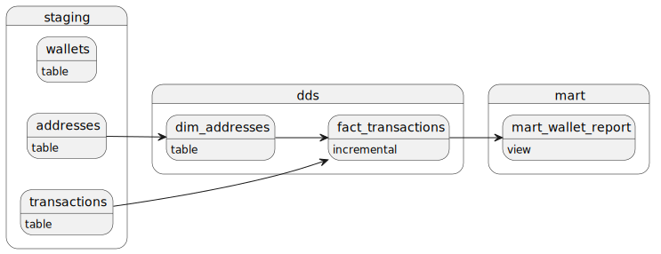
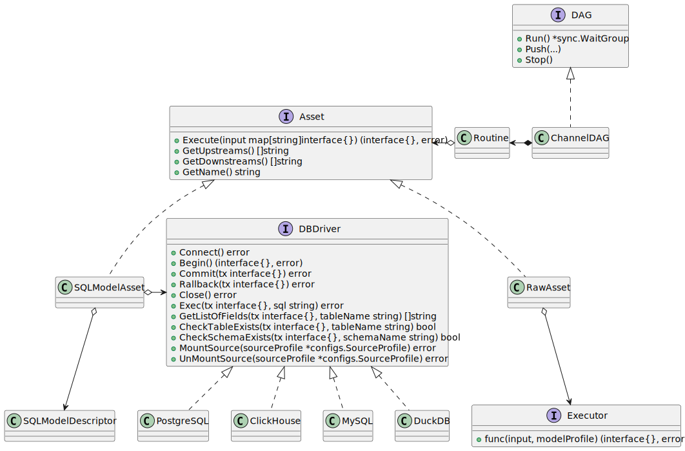

# Teal

- [Teal](#teal)
  - [QuickStart](#quickstart)
  - [Configuration](#configuration)
    - [config.yaml](#configyaml)
    - [profile.yaml](#profileyaml)
      - [Model Profile](#model-profile)
  - [Materializations](#materializations)
  - [Template functions](#template-functions)
    - [Static and dynamic functions](#static-and-dynamic-functions)
    - [List of functions](#list-of-functions)
  - [Databases](#databases)
    - [DuckDB](#duckdb)
  - [General Architecture](#general-architecture)
    - [Cross database references](#cross-database-references)
  - [Raw Assets](#raw-assets)
    - [Registration and declaration of a raw asset](#registration-and-declaration-of-a-raw-asset)
  - [Data testing](#data-testing)
    - [Simple model testing](#simple-model-testing)
      - [Test profile](#test-profile)
  - [Road Map](#road-map)
    - [\[0.2.0+\]](#020)
  - [Contact](#contact)

In the changing field of data engineering, having strong, scalable, and user-friendly tools is essential. We introduce Teal, a new open-source ETL tool designed to improve your data transformation and orchestration.

Teal combines the best features of tools like [dbt](https://www.getdbt.com/), [Dagster](https://dagster.io/), and [Airflow](https://airflow.apache.org/), while solving common problems found in traditional Python-based solutions. Our goal is to provide data engineers and analysts with a powerful, easy-to-use platform that simplifies complex workflows and increases productivity.

Why Choose Teal?

- **Scalable Architecture:** Easily scale your data pipelines to handle datasets of any size, ensuring high performance and reliability.
- **Flexible Integration:** Integrate smoothly with various data sources and destinations, offering great flexibility and connectivity.
- **Optimized Performance with Go:** Teal uses Go's concurrency model with goroutines and channels to maximize performance and efficiency. This ensures your data pipelines run quickly and reliably, making the best use of your system's resources.
- **Go Stack Advantage:** Built on the efficient Go stack, Teal offers high performance, low latency, and excellent scalability. The simplicity and power of Go provide a solid foundation for managing complex ETL workflows.

## QuickStart

### Installation <!-- omit from toc -->

```bash
go install github.com/go-teal/teal/cmd/teal@latest
```

### Creating your project <!-- omit from toc -->

```bash
mkdir my_test_project
cd my_test_project
```

### Init your project from scratch <!-- omit from toc -->

```bash
teal init
```

```bash
❯ ls -al
total 16
drwxr-xr-x@ 6 wwtlf  wwtlf  192 24 Jun 21:23 .
drwxr-xr-x  5 wwtlf  wwtlf  160 24 Jun 21:21 ..
drwxr-xr-x@ 3 wwtlf  wwtlf   96 24 Jun 07:46 assets
-rw-r--r--@ 1 wwtlf  wwtlf  302 24 Jun 07:51 config.yaml
drwxr-xr-x@ 2 wwtlf  wwtlf   64 24 Jun 20:03 docs
-rw-r--r--@ 1 wwtlf  wwtlf  137 24 Jun 07:46 profile.yaml
```

### Update **config.yaml** <!-- omit from toc -->

```yaml
version: '1.0.0'
module: github.com/my_user/my_test_project
connections:
  - name: default
    type: duckdb
    config:
      path: ./store/test.duckdb            
      extensions:
        - postgres
        - httpfs         
      # extraParams: 
      #   - name: "name"
      #     value: "value"
```

1. `module` param will be used as a module in go.mod
2. Make sure the dir from the `path` exists.

### Update **profile.yaml** <!-- omit from toc -->

```yaml
version: '1.0.0'
name: 'my-test-project'
connection: 'default'
models: 
  stages:
    - name: staging
    - name: dds  
    - name: mart
```

1. `name` will be used as a name for the binary file

### Generate go project <!-- omit from toc -->

```bash
teal gen
```

You'll see the following outpout

```bash
project-path: .
config-file: ./config.yaml
Building: staging.addresses.sql
Building: staging.transactions.sql
Building: staging.wallets.sql
Building: dds.dim_addresses.sql
Building: dds.fact_transactions.sql
Building: mart.mart_wallet_report.sql
Files 10
./cmd/my-test-project/main._go .................................................. [OK]
./go.mod ........................................................................ [OK]
./internal/assets/staging.addresses.go .......................................... [OK]
./internal/assets/staging.transactions.go ....................................... [OK]
./internal/assets/staging.wallets.go ............................................ [OK]
./internal/assets/dds.dim_addresses.go .......................................... [OK]
./internal/assets/dds.fact_transactions.go ...................................... [OK]
./internal/assets/mart.mart_wallet_report.go .................................... [OK]
./internal/assets/configs.go .................................................... [OK]
./docs/graph.wsd ................................................................ [OK]
```

Your DAG is depicted in the PlantUML file `graph.wsd`


1. Rename `main._go` to `my-test-project.go`
2. Uncomment the following line: `_ "github.com/marcboeker/go-duckdb"` in `my-test-project.go`.
3. Run `go mod tidy`
4. Final project structure:

```bash
.
├── assets
│   └── models
│       ├── dds
│       │   ├── dim_addresses.sql
│       │   └── fact_transactions.sql
│       ├── mart
│       │   └── mart_wallet_report.sql
│       └── staging
│           ├── addresses.sql
│           ├── transactions.sql
│           └── wallets.sql
├── cmd
│   └── my-test-project
│       └── main.go
├── config.yaml
├── docs
│   └── graph.wsd
├── go.mod
├── go.sum
├── internal
│   └── assets
│       ├── configs.go
│       ├── dds.dim_addresses.go
│       ├── dds.fact_transactions.go
│       ├── mart.mart_wallet_report.go
│       ├── staging.addresses.go
│       ├── staging.transactions.go
│       └── staging.wallets.go
├── profile.yaml
└── store
    ├── addresses.csv    
    ├── transactions.csv
    └── wallets.csv
```

### Run your project <!-- omit from toc -->

```bash
go run ./cmd/my-test-project
```

### Explore my-test-project.go <!-- omit from toc -->

```go
package main

import (
  _ "github.com/marcboeker/go-duckdb"

  "fmt"
  "os"

  "github.com/rs/zerolog"
  "github.com/rs/zerolog/log"

  "github.com/go-teal/teal/pkg/core"
  "github.com/go-teal/teal/pkg/dags"
  "github.com/my_user/my_test_project/internal/assets"
)

func main() {
  log.Logger = log.Output(zerolog.ConsoleWriter{Out: os.Stderr})
  fmt.Println("my-test-project")
  core.GetInstance().Init("config.yaml", ".")
  config := core.GetInstance().Config
  dag := dags.InitChannelDag(assets.DAG, assets.PorjectAssets, config, "instance 1")
  wg := dag.Run()
  result := <-dag.Push("TEST", nil, make(chan map[string]interface{}))
  fmt.Println(result)
  dag.Stop()
  wg.Wait()
}
```

What this code does:

1. `dag.Run()` builds a DAG based on Ref from your .sql models, where each node is an asset and each edge is a GO channel.
2. `result := <-dag.Push("TEST", nil, make(chan map[string]interface{}))` triggers the execution of this DAG synchronously.
3. `dag.Stop()` sends the deactivation command.

## Configuration

### config.yaml

```yaml
version: '1.0.0'
module: github.com/my_user/my_test_project
connections:
  - name: default
    type: duckdb
    config:
      path: ./store/test.duckdb            
      extensions:
        - postgres
        - httpfs         
      # extraParams: 
      #   - name: "name"
      #     value: "value"
```

1. Teal supports multiple connections.

2. The following databases are supported at the moment (v0.1.2):
    - [DuckDB](#duckdb), see the specific config params.

|Param   |Type   |Description                                                   |
|--------|-------|--------------------------------------------------------------|
|version|String constant|1.0.0|
|module|String|Generated go module name|
|connections|String|Array of database connections|
|connections.name|String|Name of the connection for model profile|
|connections.type|String|Driver name of the database connection, DuckDB, PostgreSQL, etc.|

### profile.yaml

```yaml
version: '1.0.0'
name: 'my-test-project'
connection: 'default'
models: 
  stages:
    - name: staging
      models:
        - name: model1
        # see models pfofiles
          tests:
            - name: "test.name"
            # see test pfofiles
    - name: dds  
    - name: mart
      models:
        - name: custom_asset
          materialization: 'raw'
          connection: 'default'
          raw_upstreams:
            - "dds.model1"
            - "dds.model2"
```

|Param|Type|Description|
|-----|----|-----------|
|version|String constant|1.0.0|
|name|String|Generated folder name for main.go|
|connection|String|Connection from `config.yaml` by default|
|models.stages:|Array of stages|list of stages for models. For each stage a folder `assets/models`/`<stage name>` must be created in advance|
|models.stages|See: [Model Profile](#model-profile)||
|models.stages.`name: <stage name>`.models.`<name: model name>`.tests|See: [Test Profile](#test-profile)|Test cases defined in the model profiles are executed immediately after the execution of the model itself|
|models.stages.`name: <stage name>`.models.`<name: model name>`.raw_upstreams|See: [Raw assets](#raw-assets)|A list of upstreams that supply data to this raw asset or that must be executed before this asset is run.|

#### Model Profile

The asset profile can be specified via the `profile.yaml` file or via a GO template in your sql model file in the sub-template `{{ define "profile.yaml" }} ... {{ end }}`:

```yaml
{{ define "profile.yaml" }}
    connection: 'default'
    materialization: 'table'  
    is_data_framed: true
{{ end }}

select
    id,
    wallet_id,
    wallet_address,
    currency
    from read_csv('store/addresses.csv',
    delim = ',',
    header = true,
    columns = {
        'id': 'INT',
        'wallet_id': 'VARCHAR',
        'wallet_address': 'VARCHAR',
        'currency': 'VARCHAR'}
    )
```

|Param|Type|Default value|Description|
|-----|----|-------------|-----------|
|name|String|filename|The model name must be the same as the file name without regard to the system extension (.sql)|
|connection|String|profile.connection|Connection name from `config.yaml`|
|materialization|String|table|See [Materializations](#materializations)|
|is_data_framed|boolean|false|See [Cross database references](#cross-database-references)|
|persist_inputs|boolean|false|See [Cross database references](#cross-database-references)|

## Materializations

|Materializations|Description|
|---|---|
|table|The result of SQL query execution is stored in the table corresponding to the model name. If the table does not exist, it will be created. If the table already exists, it will be cleared using the truncate method.|
|incremental|The result of the query execution is added to the existing table.  If the table does not exist, it will be created.|
|view|The SQL query is saved as a View. |
|custom| A custom SQL query is executed, no tables or views are created |
|raw| A custom Go function is executed |

## Template functions

### Static and dynamic functions

Functions in double braces `{{ Ref "staging.model" }}` are static, i.e. values are substituted at the moment of project generation.
Functions in triple braces `{{{ Ref "staging.model" }}}` are dynamic, i.e. they are executed at the moment of activation of your asset. After project generation, triple brackets are replaced by double brackets in the source code of assetts

### List of functions

Native available functions:

|Function|Input Parameters|Output data|Description|
|--|--|--|--|
|Ref|`"<staging name>.<model name>"`|string|`Ref` is the main function on which the DAG is based. It points to the model that will be replaced by the table name after the template is executed.|
|this|No|string|`this` function returns the name of the current table|
|IsIncremental|No|boolean|`IsIncremental` function returns the sign of model execution in the increment mode|

## Databases

### DuckDB

1. To enable DuckDB support, the following line `_ "github.com/marcboeker/go-duckdb"` must be added to `main.go`
2. Specific config params:

|Param|Type|Description|
|-----|----|-----------|
|extensions|Array of strings|List of [DuckDB extenstions](https://duckdb.org/docs/extensions/overview.html). Extenstions will be install during the creation of database and loaded befor the asset execution|
|path|String|Path to the DuckDB database file|
|extraParams|Object|Pairs of the name->values parameters for [DuckDB configuration](https://duckdb.org/docs/configuration/overview.html)|

## General Architecture



### Cross database references

Cross database references allow seamless queries to be executed. Seamless queries are queries that allow retrieving the result of an asset that is connected to another database, even one using a different database driver.

The following two model profile parameters are responsible for cross base references:

- **is_data_framed**. If this flag is set to True, the result of query execution is saved to the [gota.Dataframe](https://github.com/go-gota/) structure. This structure is then passed to the next node in your DAG.
- **persist_inputs**. If this flag is set to true, all incoming parameters in the form of gota.DataFrame structure are saved to a temporary table in the database connection that is configured in the connection parameter of the model profile. You don't need to change the reference to the asset for this.


## Raw Assets

Raw assets are custom functions written in Go that can accept and return dataframes and contain any other custom logic.

Raw assets must implement the following function interface:

```Go
type ExecutorFunc func(input map[string]interface{}, modelProfile *configs.ModelProfile) (interface{}, error)
```

Retrieving a dataframe from an upstream is done as follows:

```Go
df := input["dds.model1"].(*dataframe.DataFrame)
```
At the same time, the `is_data_framed` flag must be set in the upstream asset.
A custom asset can return a dataframe, which can then be seamlessly(see: [Cross database references](#cross-database-references)) used in an SQL query or in another custom dataframe.

### Registration and declaration of a raw asset

A raw asset must be registered in the main function.

```Go
processing.GetExecutors().Execurots["<staging>.<asset name>"] = youPackage.YouRawAssetFunction
```

Upstream dependencies in a DAG are set through the `raw_upstreams` parameters in the model profile (see: [profile.yaml](#profileyaml))

## Data testing

### Simple model testing

Simple tests are tests that verify data integrity after processing an SQL query, which should return the number of rows. If the returned count is zero, the test is considered successfully passed.

Tests for models should be added to the folder: `assets/tests` or `assets/tests/<stage name>`.

Example:

```sql
{{- define "profile.yaml" }}
    connection: 'default'          
{{-  end }}
select pk_id, count(pk_id) as c from {{ Ref "dds.fact_transactions" }} group by pk_id having c > 1
```

The generated source code for testing is located in the `modeltests` package.
To call all test cases, add the following line to your `main.go` file: `modeltests.TestAll()`

Test cases defined in the model profiles are executed immediately after the execution of the model itself.
In order for the tests to be executed immediately after the models, the DAG must be initialized with the following command: `dag := dags.InitChannelDagWithTests(assets.DAG, assets.PorjectAssets, modeltests.PorjectTests, config, "instance 1")`

#### Test profile

|Param|Type|Default value|Description|
|-----|----|-------------|-----------|
|connection|String|profile.connection|Connection name from `config.yaml`|

## Road Map

see CHANGELOG.md

### [0.2.0+]

#### Features <!-- omit from toc -->

- [ ] Advanced Tests
- [ ] Seeds
- [ ] Database Sources
- [ ] Pre/Post-hooks
- [ ] Embedded UI Dashboard
- [ ] DataVault

#### Database support <!-- omit from toc -->

- [ ] PostgreSQL (comming soon)
- [ ] MySQL
- [ ] ClickHouse
- [ ] SnowFlake

#### Workflow <!-- omit from toc -->

- [ ] Temporal.io
- [ ] Kafka Distributed

## Contact

- **Name:** *Boris Ershov*
- **Email:** *<boris109@gmail.com>*
- **Social media:** *<https://www.linkedin.com/in/boris-ershov-2a4b9963/>*
